# 🚀 Jenkins CI Setup Guide

A comprehensive guide to setting up Jenkins CI integration with GitHub.

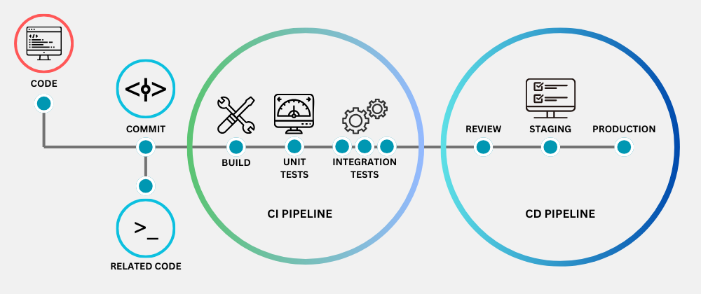

---

## 🔗 Creating a CI Test Job

1. Click **New Item** in the left-side navigation bar.  
2. Enter a **Name** (e.g. `caleb-job-ci-test`).  
3. Select **Freestyle project**.  
   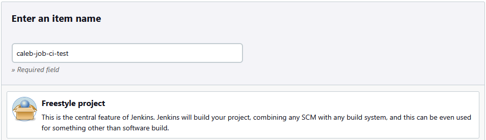

4. Add a **Description** – make it meaningful.  
5. Tick **Discard old builds**:  
   - Set **Max number of builds to keep** = `3`.  
   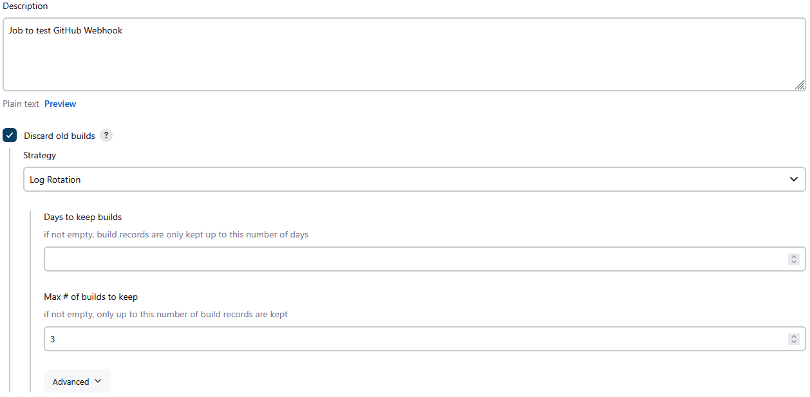

6. Tick **GitHub project**:  
   - Paste in the repository URL from your browser (ensure it ends with a `/`).  
   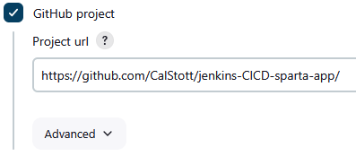

7. Under **Source Code Management**:  
   - Select **Git**.  
   - Paste the **SSH clone link** from GitHub.  
   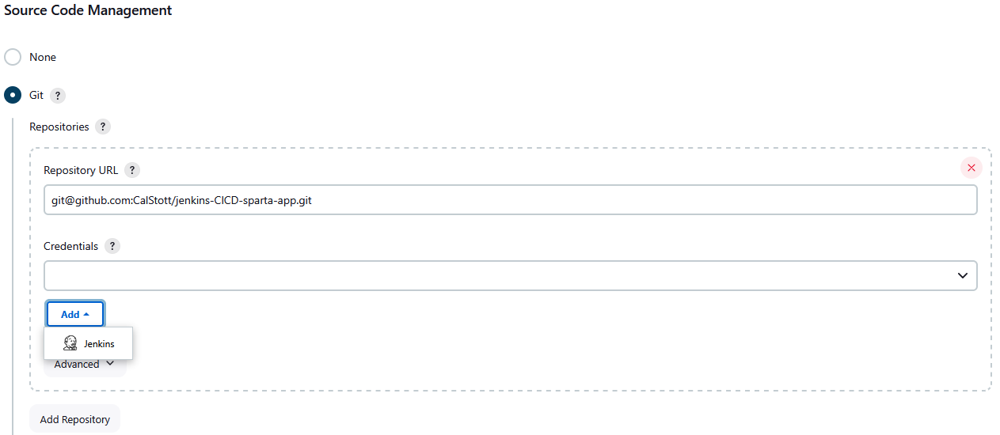

   - Create an **SSH Key Pair**
     - Add the **public key** to your GitHub Repo following these [steps](#-adding-ssh-key-to-github)

   - Click **Add** underneath credentials:
     - **Domain**: Global  
     - **Kind**: SSH Username with private key  
       - **Scope**: Global  
       - **ID**: e.g. `tech503-caleb-jenkins-github-nodejs-key`  
       - **Description**: Clear and descriptive  
       - **Username**: Same as ID  
       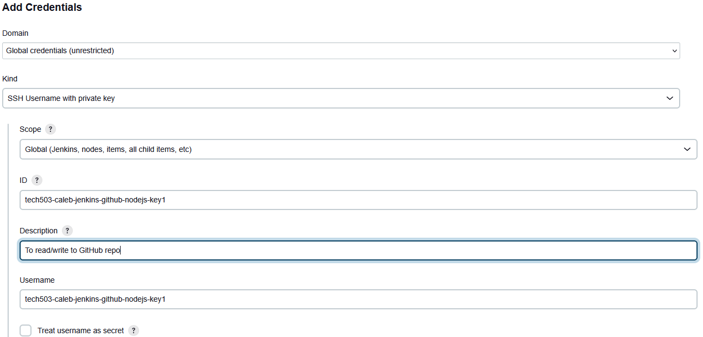
       - **Private Key**:  
         - Select **Enter directly**  
         - Paste your **private key**  
         - Click **Save**  
         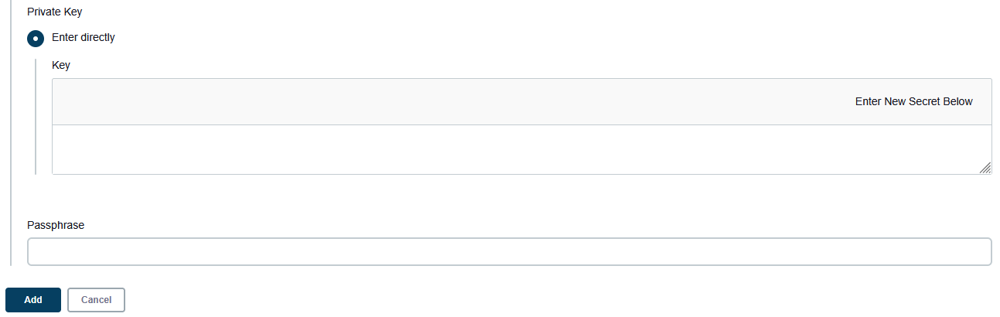

   - Select your newly added **Credential**.  
   - Under **Branches to build**:  
     - Change **Branch Specifier** to `*/dev`.  
     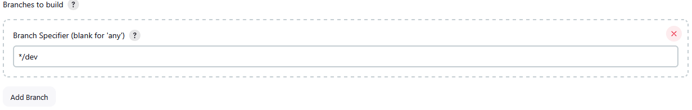

8. Under **Build Triggers**:  
   - Tick **GitHub hook trigger for GITScm polling**  
   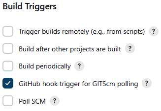

   - Setup the Webhook on GitHub following these [steps](#-setting-up-github-webhook)

9. Under **Build Environment**:  
   - Tick **Provide Node & npm bin/folder to PATH**  
   - Select **NodeJS Version 20**  
   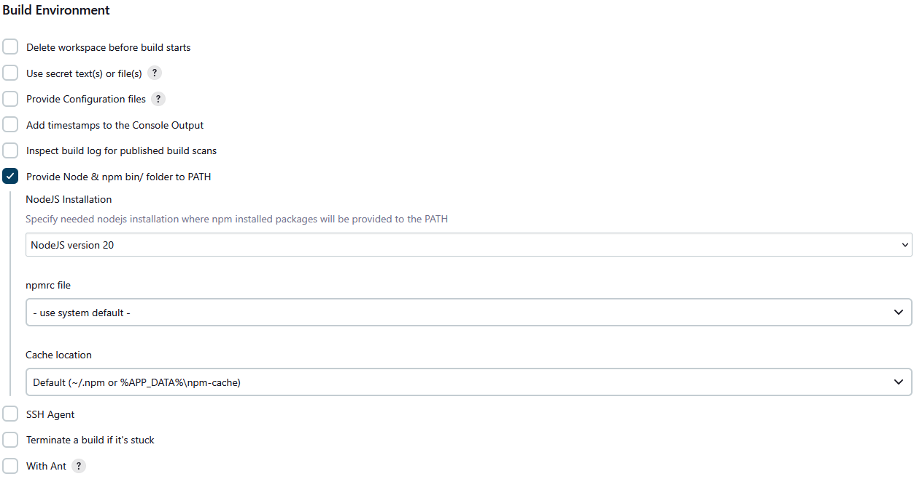

10. Under **Build Steps > Execute Shell**, add:
    ```bash
    ls
    cd app
    npm install
    npm test
    ```
    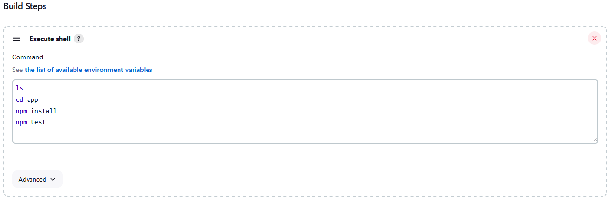

11. Click **Save**.

> **Note:** To run the job manually, click **Build Now** in the left navigation bar.  
> To view logs, open the dropdown for the build and click **Console Output**.  
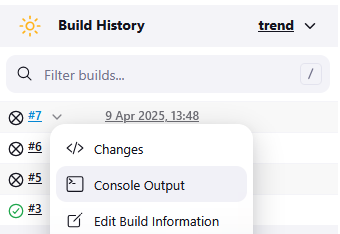

---

## Creating a CI Merge Job

1. Click **New Item** in the left-side navigation bar.  
2. Enter a **Name** (e.g. `caleb-job-ci- merge-test`).
3. Select **Copy from**
   1. Select your CI test job
4. Change the **Description** - explain what this job is doing
5. Under **Build Triggers**
   1. Untick the GitHub hook trigger for GITScm polling
6. Under **Build Steps**
   1. Delete the **Execute Shell** from the previous job
7. Under **Post-build Actions**
   1. Select **Git Publisher** from the dropdown
      1. Tick **Push Only if Build Succeeds**
      2. Tick **Merge Results**
      3. **Branches** > **Add Branch**
         1. **Branch to push** - main
         2. **Target remote name** - origin
8. Save
9. Go to your **CI Test Job** from the Dashboard
   1.  Under **Post-build Actions**
       1.  Select **Build other projects**
           1.  Type your **CI Merge Job** into the box and remove the colon and whitespace after it
           2.  Make sure **Trigger only if build is stable** is ticked
   2.  Save
10. Make a change to your dev branch, and when it is saved, added, committed and pushed to dev the jobs will trigger

---

## 🔁 Linking Jobs

1. Go to **Dashboard > Select Job**.  
2. Click **Configure**.  
3. Scroll to **Post-build Actions**:  
   - Select **Build other projects**  
   - Enter the **job name** to trigger  
   - Tick **Build only if stable**  
   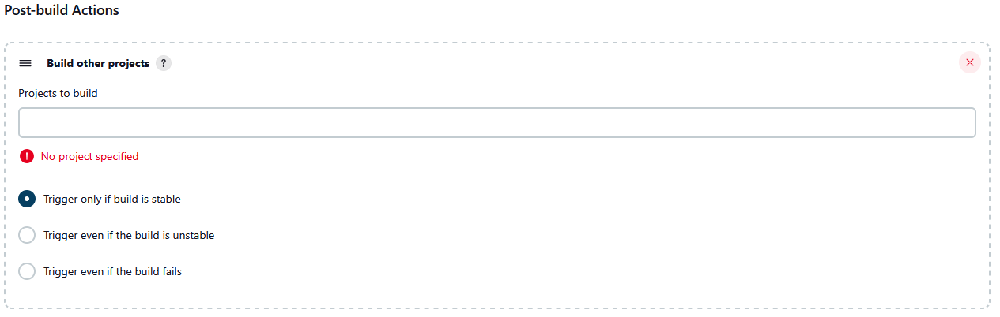

---

## 🔐 Adding SSH Key to GitHub

1. Navigate to your GitHub **Repo > Settings > Deploy keys**  
   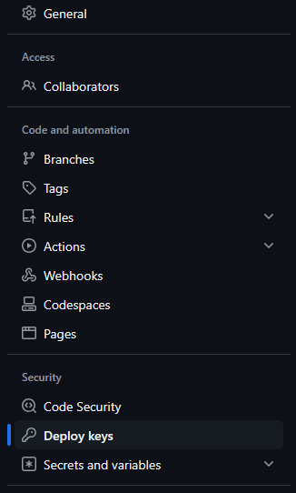

2. Click **Add deploy key**  
3. Enter a **Name** for your key  
4. Paste your **public key** into the key field  
5. Tick **Allow write access**  
6. Click **Add key**  
   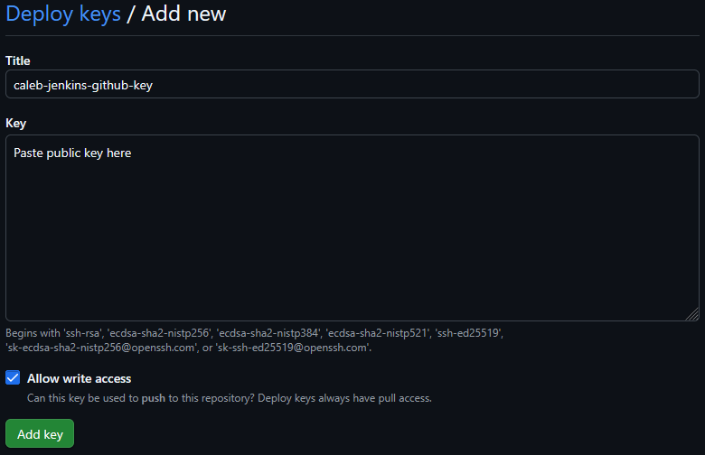

> ⚠️ **Important:** A GitHub SSH key can only be used with **one** repository.

---

## 📡 Setting up GitHub Webhook

1. Go to your repository on GitHub.  
2. Navigate to **Settings > Webhooks**  
   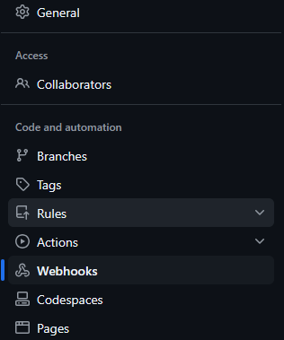

3. Click **Add webhook**  
   - **Payload URL**: Enter your Jenkins URL followed by `/github-webhook/`  
     Example:  
     ```
     http://jenkins-ip-here:8080/github-webhook/
     ```
   - **SSL verification**: Tick **Disable**  
   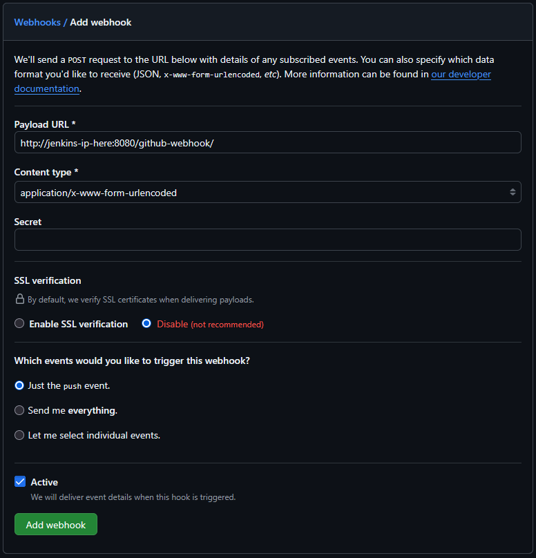

4. Click **Add webhook**

---
