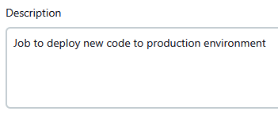
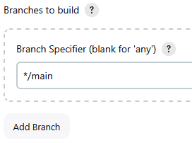
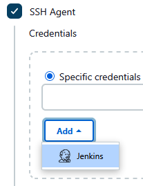
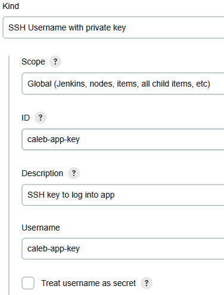
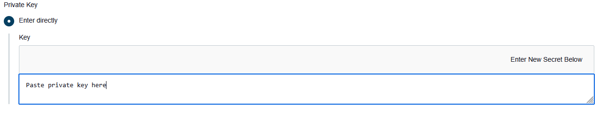
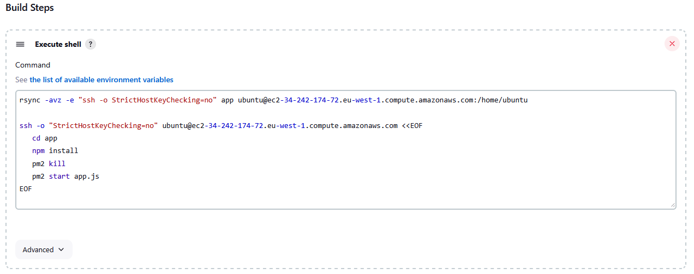
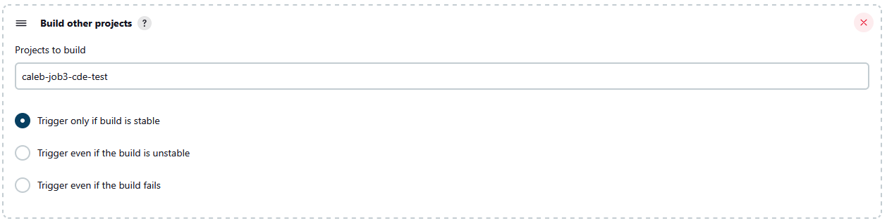
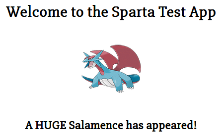

# Jenkins CDE Job Creation Guide

This guide walks you through the process of creating a Continuous Deployment (CDE) job in Jenkins.

---

## 1. Create a New Item

- Go to Jenkins dashboard.
- Click **New Item**.
- Enter a name, e.g. `caleb-job3-cde-test`.
- Select **Copy from**.
  - Copy from your existing **CI merge job**.

---

## 2. Add a Description

- Add a meaningful **description** to identify the job.  
    
---

## 3. Configure Source Code Management

- Select **Git** (or your appropriate SCM).
- Under **Branches to build**, set:
  - **Branch Specifier**: `/main`  
    

---

## 4. Set Up Build Environment

- Tick **SSH Agent**.
  - Under **Credentials**, click **Add > Jenkins**.  
    

    - **Name**: e.g. `tech503-caleb-aws-key`
    - **Description**: SSH key for logging into production environment
    - **ID**: same as the **Name**  
    

    - Select **Enter directly**
      - Paste your **private key** into the box  
         

    - Click **Add**

---

## 5. Configure Build Steps

- Add a **Build Step**: **Execute shell**
  - Paste the following commands:

    ```bash
    # This command copies the new code into the app instance
    rsync -avz -e "ssh -o StrictHostKeyChecking=no" app ubuntu@instance-ip:/home/ubuntu

    # This command contains all of the commands that will run after accessing the app instance via SSH
    ssh -o "StrictHostKeyChecking=no" ubuntu@instance-ip <<EOF
      cd app
      npm install
      pm2 kill
      pm2 start app.js
    EOF
    ```  
    

---

## 6. Save the Job

- Click **Save** to create the job.

---

## 7. Update the Merge Job

To trigger the CDE job upon successful merge:

- Open your **CI merge job**.
- Scroll to **Post-build Actions**.
- Click **Add post-build action > Build other projects**.
  - **Project to build**: Select your newly created **CDE job**
  - Tick **Trigger only if build is stable**
  - **Drag this action** beneath the **Git Publisher** action if necessary
   

---

## 8. View your Changes!

Make a change to the `dev` branch, push the change, and watch it happen automatically on the app!
