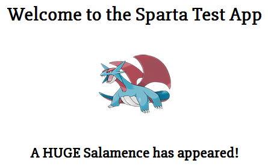

# Jenkins Server Guide

## Follow VPC Deployment Guide

Click [here](https://github.com/CalStott/VPCs) for instructions

---

## Creating a Jenkins EC2 Instance

1. **Launch New Instance** from EC2 Dashboard  
2. **Name** e.g. `tech503-caleb-jenkins-server`  
3. **Images**
   - Quick Start or My AMIs (if you have an image already)
   - Select **Ubuntu 22.04** or your Jenkins image
4. **Instance Type**
   - `t2.micro` or `t3.micro`
5. **Key Pair**
   - Select your SSH key
6. **Network Settings**
   - Edit
   - Select your **VPC** from the dropdown
   - Select your **Subnet** from the dropdown
   - **Auto-assign public IP** – Enable
   - **Firewall**
     - Create Security Group
     - Name e.g. `tech503-caleb-jenkins-sg-vpc`
     - Description – same as name
     - Rules:
       - Port `22` – SSH
       - Port `80` – HTTP
       - Port `8080` – Jenkins
7. **Launch instance**

---

## Installing Dependencies

1. **Connect to your EC2 instance via SSH**

2. **Install Jenkins**  
   Run these commands:
   ```bash
   # Get GPG key from URL and save to file to verify installs
   sudo wget -O /usr/share/keyrings/jenkins-keyring.asc \
   https://pkg.jenkins.io/debian-stable/jenkins.io-2023.key

   # Register the Jenkins APT repository securely for installation
   echo "deb [signed-by=/usr/share/keyrings/jenkins-keyring.asc]" \
   https://pkg.jenkins.io/debian-stable binary/ | sudo tee \
   /etc/apt/sources.list.d/jenkins.list > /dev/null

   # Update packages and install Jenkins
   sudo apt-get update
   sudo apt-get install jenkins -y
   ```

3. **Install Java**  
   Run these commands:
   ```bash
   sudo apt install fontconfig openjdk-17-jre -y
   java -version
   ```
   You should see the Java version output in the terminal.

4. **Start Jenkins**  
   Run these commands:
   ```bash
   sudo systemctl enable jenkins
   sudo systemctl start jenkins
   ```
   Optional: Check status –  
   ```bash
   sudo systemctl status jenkins
   ```

5. **Access Jenkins via Browser**
   - Go to your EC2 instance's public IP address
   - Fetch the admin password:
     ```bash
     sudo cat /var/lib/jenkins/secrets/initialAdminPassword
     ```
   - Paste the output into the website to unlock Jenkins

---

## Customising Jenkins

1. **Install Suggested Plugins**

2. **Create a user** or skip and continue as admin

3. **Install Plugins**
   - Go to: **Dashboard > Manage Jenkins > Plugins**
   - Available Plugins:
     - Search and install **NodeJS** plugin
     - Search and install **SSH Agent** plugin

4. **Configure NodeJS Tool**
   - Go to: **Dashboard > Manage Jenkins > Tools**
     - NodeJS > Add NodeJS
     - Name: e.g. `NodeJS 20.0.0`
     - Save  
     

5. **Configure Git Host Key Verification**
   - Go to: **Dashboard > Manage Jenkins > Security**
     - Git Host Key Verification Configuration
       - Select **Manually provided keys**
       - Paste the following:
         ```bash
         github.com ssh-ed25519 AAAAC3NzaC1lZDI1NTE5AAAAIOMqqnkVzrm0SdG6UOoqKLsabgH5C9okWi0dh2l9GKJl
         ```  
         

---

## Create Your Pipeline

1. **Job 1 – Test the Code Base + GitHub Webhook**
   - Click [here](./02-jenkins-ci-setup.md) for instructions

2. **Job 2 – Merge Code into `main`**
   - Add this job as a **Post-build Action** in Job 1

3. **Job 3 – Run the App**
   - Click [here](./03-jenkins-cde-setup.md) for instructions
   - Add this job as a **Post-build Action** in Job 2

---

## Test Your Pipeline!

- Make a change to your `dev` branch and push the changes  
- This will trigger the pipeline  
  
